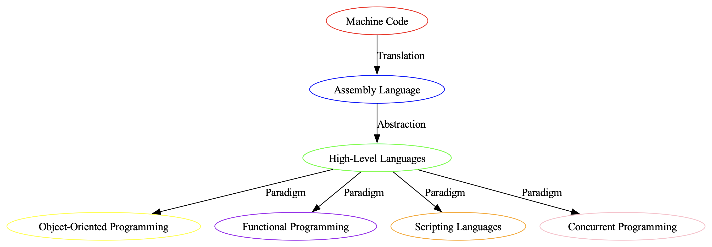

# Pipeline Sample

This section contains different example pipelines that showcase different tasks, maybe you can take inspiration from them. We strongly believe that better data leads to better models, and synthetic data has proven to be really effective in improving LLMs, so we aim to bridge the gap between research and practice by providing these implementations.

## Tutorials

## Paper Implementations

Contains some implementations for synthetic data generation papers, using `distilabel`, providing reproducible pipelines so that anyone can play around with those approaches and customize them to their needs.

## Examples

These are some examples of how to use `distilabel` to generate synthetic data, answer questions, generate structured data, and benchmark LLMs. They don't contain any specific content but provide a general idea of how to use `distilabel` for different tasks.

### [llama.cpp with `outlines`](#llamacpp-with-outlines)

Generate RPG characters following a `pydantic.BaseModel` with `outlines` in `distilabel`.

??? Example "See example"

    This script makes use of [`LlamaCppLLM`][distilabel.llms.llamacpp.LlamaCppLLM] and the structured output capabilities thanks to [`outlines`](https://outlines-dev.github.io/outlines/welcome/) to generate RPG characters that adhere to a JSON schema.

    It makes use of a local model which can be downloaded using curl (explained in the script itself), and can be exchanged with other `LLMs` like [`vLLM`][distilabel.llms.vllm.vLLM].

    ??? Run

        ```python
        python examples/structured_generation_with_outlines.py
        ```

    ```python title="structured_generation_with_outlines.py"
    --8<-- "examples/structured_generation_with_outlines.py"
    ```


### [MistralAI with `instructor`](#mistralai-with-instructor)

Answer instructions with knowledge graphs defined as `pydantic.BaseModel` objects using `instructor` in `distilabel`.

??? Example "See example"

    This script makes use of [`MistralLLM`][distilabel.llms.mistral.MistralLLM] and the structured output capabilities thanks to [`instructor`](https://python.useinstructor.com/) to generate knowledge graphs from complex topics.

    This example is translated from this [awesome example](https://python.useinstructor.com/examples/knowledge_graph/) from `instructor` cookbook.

    ??? Run

        ```python
        python examples/structured_generation_with_instructor.py
        ```

    ```python title="structured_generation_with_instructor.py"
    --8<-- "examples/structured_generation_with_instructor.py"
    ```

    ??? "Visualizing the graphs"

        Want to see how to visualize the graphs? You can test it using the following script. Generate some samples on your own and take a look:

        !!! NOTE

            This example uses graphviz to render the graph, you can install with `pip` in the following way:

            ```console
            pip install graphviz
            ```

        ```python
        python examples/draw_kg.py 2  # You can pass 0,1,2 to visualize each of the samples.
        ```

        


### [Benchmarking with `distilabel`: Arena Hard](#benchmarking-with-distilabel-arena-hard)

Benchmark LLMs with `distilabel`: reproducing the Arena Hard benchmark.

??? Example "See example"

    The script below first defines both the `ArenaHard` and the `ArenaHardResults` tasks, so as to generate responses for a given collection of prompts/questions with up to two LLMs, and then calculate the results as per the original implementation, respectively. Additionally, the second part of the example builds a `Pipeline` to run the generation on top of the prompts with `InferenceEndpointsLLM` while streaming the rest of the generations from a pre-computed set of GPT-4 generations, and then evaluate one against the other with `OpenAILLM` generating an alternate response, a comparison between the responses, and a result as A>>B, A>B, B>A, B>>A, or tie.

    To run this example you will first need to install the Arena Hard optional dependencies, being `pandas`, `scikit-learn`, and `numpy`.

    ```python title="arena_hard.py"
    --8<-- "examples/arena_hard.py"
    ```

